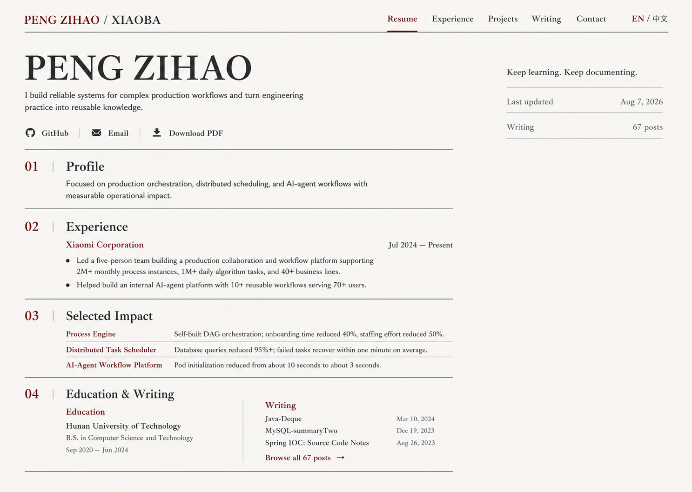

# Bilingual Resume Blog Design

**Status:** Approved visual direction; written specification awaiting review

**Date:** 2026-08-07

**Product:** xiaobazeo.com / Hexo personal site

**Primary source workspace:** `/Users/pengzihao/blog`

**Deployment repository:** `/Users/pengzihao/pzh_project/github_project/xiaobazeo.github.io`

## Goal

Replace the current Butterfly presentation with a quiet, paper-inspired resume theme that helps a recruiter understand Peng Zihao's work and measurable impact quickly, while preserving the existing Hexo article archive.

The default resume homepage is English. A visible `EN / 中文` switch opens a complete Chinese version. Neither language version presents a job title, department, or technology-stack section.

## Approved Visual Target

The approved direction uses:

- an ivory paper-like base without texture or decoration;
- dark charcoal type and a restrained burgundy accent;
- editorial serif headings paired with a clean sans-serif body;
- thin rules, section numbers, and a wide resume grid;
- no cards, hero photography, gradients, shadows, portraits, badges, or dashboard widgets;
- a narrow metadata column that supports rather than competes with the resume.

## Product Context

The complete Hexo source already exists at `/Users/pengzihao/blog`; rebuilding the source from generated HTML is unnecessary. It contains:

- Hexo 5.4.2 configuration and dependencies;
- 67 Markdown posts under `source/_posts`;
- the current Butterfly and Yilia themes;
- generated `public` and `.deploy_git` directories;
- GitHub Pages deployment configuration for the `master` branch.

The deployed repository contains generated pages and is not the authoring source. Theme work must be performed against the complete Hexo source, then generated output is deployed to the Pages repository.

## Audience And Success Criteria

### Primary audience

Recruiters and hiring decision-makers who need to understand the candidate's scope and results within one minute.

### Secondary audience

Engineering peers who arrive through a technical article and want to learn more about the author's production experience.

### Success criteria

1. The first viewport identifies Peng Zihao and communicates the nature of his work without displaying a job title or department.
2. English is the default homepage at `/`.
3. The `EN / 中文` control makes the Chinese resume available in one action.
4. Xiaomi experience and three representative outcomes are concise, factual, and readable without opening the PDF.
5. The 67 existing article URLs remain valid after the theme migration.
6. The homepage remains calm and legible at desktop, tablet, and mobile widths.

## Scope

### Included

- A new custom Hexo theme named `resume-paper`.
- An English resume homepage at `/`.
- A Chinese resume homepage at `/zh-cn/`.
- A real language switch implemented as ordinary links, so it works without JavaScript.
- Minimal archive, tag, and article templates that share the approved visual system.
- Existing Markdown posts, paths, tags, feeds, sitemap, code blocks, images, and comments.
- A downloadable PDF resume link.
- Responsive and accessible navigation.
- Correct canonical and language-alternate metadata.

### Excluded

- Translating the bodies of the existing 67 Chinese articles.
- Automatic machine translation.
- A technology-stack, skills, proficiency, or badge section.
- Job-title or department labels on either resume homepage.
- A CMS, database, new backend, analytics dashboard, or contact form.
- Reintroducing Butterfly's decorative ribbon, click text, large image hero, reward panel, dense sidebar, or animated loading screen.

## Language Model

The bilingual scope applies to the resume homepage and its navigation/content.

- `/` is the canonical English resume homepage.
- `/zh-cn/` is the Chinese resume homepage.
- The language switch uses visible text `EN / 中文`; the active language uses the burgundy accent and `aria-current="page"`.
- There is no IP-, browser-, or locale-based redirect. The default remains deterministic and shareable.
- Both pages are fully rendered static HTML. Core content is not hidden behind client-side translation.
- Each page sets the correct `<html lang>` value and links the alternate page with `hreflang="en"`, `hreflang="zh-CN"`, and `hreflang="x-default"`.
- Existing article bodies remain in Chinese and retain their current URLs. The article shell may use concise bilingual-neutral labels, but the toggle must not imply that an English article translation exists.

## Information Architecture

### English homepage

1. Masthead
   - `PENG ZIHAO / XIAOBA`
   - `Resume`, `Experience`, `Projects`, `Writing`, `Contact`
   - `EN / 中文`
2. Identity
   - `PENG ZIHAO`
   - Personal statement
   - `GitHub`, `Email`, `Download PDF`
3. `01 / Profile`
4. `02 / Experience`
5. `03 / Selected Impact`
6. `04 / Education & Writing`
7. Minimal footer with copyright and feed link

### Chinese homepage

The Chinese page uses the same order, content density, links, and visual hierarchy:

1. `彭子豪 / XIAOBA`
2. `简历`, `经历`, `项目`, `文章`, `联系`
3. `EN / 中文`
4. `个人简介`
5. `工作经历`
6. `代表成果`
7. `教育与写作`

### Blog routes

- `/archives/` remains the complete writing archive.
- `/tags/` remains the tag index.
- Existing `/:year/:month/:day/:title/` post paths remain unchanged.
- The homepage writing list links to real posts and a `Browse all 67 posts` / `查看全部 67 篇文章` archive link.

## Approved Content

### Identity

The homepage displays only the name and personal statement. It must not render any of the following:

- `Backend Engineer` or `后端开发工程师`;
- `Automotive Department`, `Autonomous Driving and Robotics Department`, `汽车部`, or `自动驾驶与机器人部`;
- a technology-stack or skills list;
- location, availability, or employment-status labels.

English statement:

> I build reliable systems for complex production workflows and turn engineering practice into reusable knowledge.

Chinese statement:

> 我专注于复杂生产流程的可靠系统建设，并将工程实践沉淀为可复用经验。

### Profile

English:

> Focused on production orchestration, distributed scheduling, and AI-agent workflows with measurable operational impact.

Chinese:

> 关注生产流程编排、分布式任务调度与 AI Agent 工作流，并以可量化结果持续改善生产效率。

### Experience

Company and dates:

- English: `Xiaomi Corporation`, `Jul 2024 — Present`
- Chinese: `小米科技有限责任公司`, `2024.07 — 至今`

No role or department line appears beneath the company.

English bullets:

1. Led a five-person team building a production collaboration and workflow platform supporting 2M+ monthly process instances, 1M+ daily algorithm tasks, and 40+ business lines.
2. Helped build an internal AI-agent platform with 10+ reusable workflows serving 70+ users.

Chinese bullets:

1. 带领 5 人团队建设生产协作与任务流转平台，支撑月均 200 万+ 流程实例、日均 100 万+ 算法任务，覆盖 40+ 业务线。
2. 参与内部 AI Agent 工程平台建设，落地 10+ 可复用工作流，服务 70+ 用户。

### Selected impact

| Project | English summary | Chinese summary |
|---|---|---|
| Process Engine / 流程引擎 | Self-built DAG orchestration; onboarding time reduced 40%, staffing effort reduced 50%. | 自研 DAG 编排；新业务接入周期缩短 40%，人力投入降低 50%。 |
| Distributed Task Scheduler / 分布式任务调度中心 | Database queries reduced 95%+; failed tasks recover within one minute on average. | DB 查询量下降 95%+；异常任务平均 1 分钟内恢复。 |
| AI-Agent Workflow Platform / AI Agent 工作流平台 | Pod initialization reduced from about 10 seconds to about 3 seconds. | Pod 初始化由约 10 秒降至约 3 秒。 |

### Education

- English: `Hunan University of Technology`, `B.S. in Computer Science and Technology`, `Sep 2020 — Jun 2024`
- Chinese: `湖南工业大学`, `计算机科学与技术 本科`, `2020.09 — 2024.06`

### Writing

The initial three links use existing posts and their real publication dates:

- `Java-Deque` — 2024-03-10
- `MySQL-summaryTwo` — 2023-12-19
- `Spring-IOC-SourceCodeAnalysis` — 2023-08-26

These links are data-driven rather than duplicated manually in the template.

## Layout And Responsive Behavior

### Desktop: 1200px and wider

- Maximum content width: 1360px.
- Main resume column: approximately 920px.
- Metadata column: approximately 300px.
- Outer page gutter: 48px minimum.
- Experience bullets and impact rows stay in the main column.
- The metadata column aligns with the identity header.

### Tablet: 768px to 1199px

- One primary column with a compact metadata row below the identity statement.
- Navigation may wrap once, but the language switch remains visible.
- Impact rows retain a label-and-summary layout when space permits.

### Mobile: below 768px

- Single column with 20px page gutters.
- Name scales down without truncation.
- Navigation becomes a compact menu; `EN / 中文` remains outside the collapsed menu.
- Experience bullets and impact rows stack vertically.
- Education and writing become consecutive sections rather than split columns.
- Contact actions remain at least 44px high and keyboard/touch accessible.

## Visual Tokens

| Token | Value | Use |
|---|---|---|
| `--paper` | `#F7F4ED` | Page background |
| `--ink` | `#20201D` | Primary text |
| `--muted` | `#68655F` | Secondary text |
| `--burgundy` | `#7A2026` | Active navigation, section numbers, links |
| `--rule` | `#AAA49A` | Hairline separators |
| `--focus` | `#1D5FD1` | Keyboard focus ring |

Typography uses no remote runtime dependency:

- Headings: `"Songti SC", "STSong", Georgia, serif`
- Body: `"Helvetica Neue", "PingFang SC", Arial, sans-serif`
- Body size: 16px desktop, 15px mobile
- Comfortable line length: 60–70 characters
- Spacing scale: 4, 8, 12, 16, 24, 32, 48, 72px

## Component Boundaries

The custom theme is split into focused units:

- `SiteHeader`: brand, section navigation, and language switch.
- `IdentityHeader`: name, statement, and external actions.
- `NumberedSection`: shared number/title/rule treatment.
- `ExperienceEntry`: company, date, and two concise bullets.
- `ImpactList`: three project outcomes as ruled rows.
- `EducationWriting`: education details plus data-driven writing links.
- `MetadataRail`: quote, last-updated date, and article count.
- `ArticleLayout`: readable long-form content, code blocks, table of contents, tags, and comments.
- `ArchiveLayout`: compact chronological article list.

Resume content is stored outside templates in a bilingual data file. Templates consume the same field names for both locales so facts and translations cannot drift silently.

## Article Experience

The resume homepage does not replace the blog:

- Article body width is limited to approximately 760px.
- Code blocks preserve syntax highlighting, language labels, and copy behavior.
- Images remain responsive and use meaningful alt text when available.
- A desktop table of contents is allowed only on long posts and becomes an inline disclosure on mobile.
- Tags, previous/next navigation, and comments remain available.
- Decorative share grids, payment/reward panels, visitor counters, and animated background effects are removed.

## Accessibility And Metadata

- Color contrast meets WCAG AA for normal text.
- Every interactive element has a visible keyboard focus state.
- Navigation uses semantic landmarks and an accessible mobile-menu button.
- Section headings follow a valid `h1` → `h2` hierarchy.
- The language switch exposes its active state to assistive technology.
- English and Chinese pages use correct `lang`, canonical, and `hreflang` metadata.
- Motion is minimal and disabled under `prefers-reduced-motion`.
- The PDF link includes a file type and download hint.
- Contact details are exposed through explicit links but phone and email text are not printed in the homepage body.

## Content And Privacy Rules

- Employment and project metrics come from the supplied resume and are not expanded with invented claims.
- The homepage omits phone number, visible email address, role, department, location, and employment-status metadata.
- `Download PDF` may expose the contact details already present in the resume; the file is downloadable only because the owner explicitly includes it.
- No client-side API key, analytics identifier, or comment-service credential is added to the resume homepage.

## Acceptance Criteria

1. Visiting `/` with a clean browser session renders English content.
2. `EN / 中文` moves between `/` and `/zh-cn/` without JavaScript.
3. Neither generated homepage contains a job-title string, department string, or technology-stack section.
4. Both homepages contain the approved Xiaomi dates, two experience bullets, and three impact summaries.
5. The three selected article links resolve to existing post URLs with correct publication dates.
6. All 67 Markdown posts generate successfully and existing permalinks remain valid.
7. Archive, tags, Atom feed, sitemap, and custom domain files remain present.
8. Desktop, tablet, and mobile screenshots show no clipping, overlap, horizontal scroll, or hidden language control.
9. Keyboard navigation reaches the language switch, navigation, contact actions, writing links, and mobile menu in logical order.
10. Page source contains correct canonical and alternate-language links.
11. The generated homepage does not load Butterfly decorative scripts or its legacy hero background.
12. The downloadable PDF link resolves successfully.

## Delivery Boundary

Implementation is complete only after the custom theme generates the full site from `/Users/pengzihao/blog`, the generated output is visually compared with the approved mock at matching desktop dimensions, responsive layouts are checked, and the deployment repository receives only verified static output. Publishing or pushing to the remote repository requires a separate explicit instruction.
